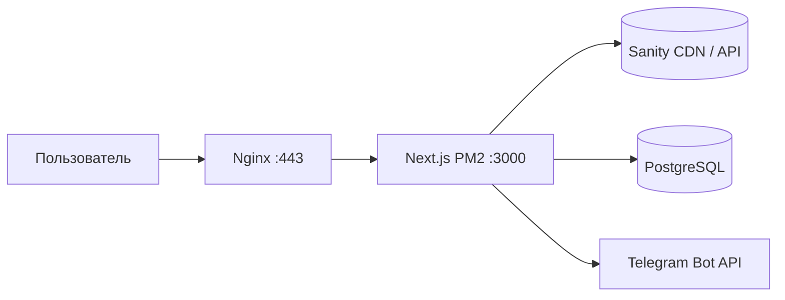

# TechZone Motors — администрирование проекта

Документ для владельца и администраторов: что это за система, как устроена, какие внешние сервисы задействованы и **какие секреты нужно иметь под рукой** (без хранения значений в репозитории).

## Назначение

Публичный сайт **TechZone Motors** (питбайки, каталог, заявки с формы). Стек: **Next.js 16** (App Router), **React 19**, контент каталога из **Sanity**, лиды в **PostgreSQL** через **Prisma**, уведомления о заявках в **Telegram**. Продакшен: **VPS** с **Nginx**, **PM2**, **Let’s Encrypt**; выкладка через **GitHub Actions** по пушу в `main`.

## Архитектура (логическая)



- **Фронт и API** — одно приложение Next.js.
- **Каталог** — чтение документов `product` из Sanity; при отсутствии проекта/сети используется локальный fallback (`lib/products-fallback.ts`).
- **Карусель на главной** — порядок карточек задаётся в Sanity: откройте Studio → в меню **Карусель главной** добавьте ссылки на товары (`product`) в нужной последовательности. Если список пуст или Sanity недоступен, главная подставляет тот же набор, что и при полной загрузке каталога.
- **Страница СВО (`/svo`)** — документы `svoProduct` из Sanity; fallback — `lib/svo-products-fallback.ts`.
- **Статьи (`/articles`, страница по slug)** — в Sanity тип документа `article` (заголовок, slug, краткое описание для списка и meta, тело в Portable Text). В Studio в разделе **Статьи**; на сайте список и детальная страница с периодическим обновлением кэша (ISR, ~60 с). В шапке сайта ссылка **Статьи** ведёт в этот раздел.
- **Заявка (контакты)** — `POST /api/contact`: отправка сообщения в Telegram, затем запись лида в БД (`Lead`).
- **CMS** — встроенная Sanity Studio по пути `/studio` (`next-sanity`).

## Репозиторий и деплой

| Элемент | Описание |
|--------|----------|
| Код | Git (удалённый репозиторий подключается у вас; в `deploy/setup-server.sh` указан пример `github.com/anvrnv/techzonemotors.git` — при расхождении ориентируйтесь на ваш фактический remote). |
| Ветка продакшена | `main` (см. `.github/workflows/deploy.yml`). |
| CI/CD | GitHub Actions: SSH на сервер, `git fetch` + `git reset --hard origin/main` (без локальных расхождений с `main`), `npm install`, `npx prisma db push`, `npm run build`, `pm2 reload techzonemotors --update-env`. |
| Каталог на сервере | `/var/www/techzonemotors` (см. workflow и `ecosystem.config.js`). |
| Процесс PM2 | Имя приложения: `techzonemotors`. |

**Важно:** секреты деплоя хранятся в **GitHub → Settings → Secrets** (не в git).

## Сервисы и что хранить

Ниже — **имена** секретов и переменных, **не значения**. Значения: менеджер паролей, GitHub Secrets, файл `.env.local` на сервере (права `600`).

### GitHub (репозиторий)

| Секрет | Назначение |
|--------|------------|
| `SSH_HOST` | IP или hostname VPS |
| `SSH_USER` | Пользователь SSH |
| `SSH_PRIVATE_KEY` | Приватный ключ для входа на сервер |

### Сервер (VPS)

| Ресурс | Зачем |
|--------|--------|
| SSH-доступ | Администрирование, ручной деплой, логи |
| Учётная запись root/sudo | Как в вашей практике (скрипт `deploy/setup-server.sh` рассчитан на типичную настройку) |
| **Let’s Encrypt** | Сертификаты путей из `deploy/nginx.conf` (`/etc/letsencrypt/live/techzonemotors.ru/…`) |
| **Nginx** | Обратный прокси на `localhost:3000` |

### Приложение (`.env.local` локально и на сервере)

| Переменная | Назначение |
|------------|------------|
| `DATABASE_URL` | Строка подключения PostgreSQL для Prisma |
| `TELEGRAM_BOT_TOKEN` | Токен бота Telegram для `POST /api/contact` |
| `TELEGRAM_CHAT_ID` | Чат (или канал), куда уходят заявки |
| `NEXT_PUBLIC_SANITY_PROJECT_ID` | Проект Sanity (публично в клиенте) |
| `NEXT_PUBLIC_SANITY_DATASET` | Датасет (часто `production`) |
| `NEXT_PUBLIC_SANITY_API_VERSION` | Версия API Sanity (опционально, есть дефолт в коде) |
| `SANITY_API_WRITE_TOKEN` | Токен с правами записи — **только** для CLI/скриптов (seed), не обязателен для работы чтения каталога на сайте |

**Studio на домене (`/studio`):** `NEXT_PUBLIC_SANITY_PROJECT_ID` и `NEXT_PUBLIC_SANITY_DATASET` должны быть в **`.env.local` на VPS до команды `npm run build`**. Next встраивает `NEXT_PUBLIC_*` в клиент при сборке; если собрать без них, Studio падала бы с общей ошибкой Sanity. После добавления или смены этих переменных снова **`npm run build`** и **`pm2 reload techzonemotors --update-env`**.

Файлы `.env*` **в git не коммитятся** (см. `.gitignore`).

### Sanity (sanity.io)

- Аккаунт/проект Sanity, **Project ID** и **Dataset**.
- **CORS** и **токены**: по документации Sanity для вашего плана; write token — для `scripts/seed-sanity-catalog.ts`, `scripts/seed-sanity-svo.ts` и аналогичных операций.

### PostgreSQL

- Хост, порт, БД, пользователь, пароль — обычно всё в `DATABASE_URL`.
- После изменений схемы на проде workflow выполняет `prisma db push` (учитывайте риски для продакшена; при необходимости замените на миграции по вашей политике).

### Домен и DNS

- `techzonemotors.ru` / `www` — как настроено у регистратора; для SSL используется Certbot в `setup-server.sh`.

## Пошагово: куда зайти и что нажать

Ниже — только последовательность действий в интерфейсах и в терминале, без «обобщений».

### A. Убедиться, что код с GitHub доехал до сервера

1. Откройте в браузере: `https://github.com/anvrnv/techzonemotors` (если репозиторий другой — ваш обычный URL репо).
2. В верхнем меню репозитория нажмите вкладку **Actions**.
3. В списке слева выберите workflow **Deploy to Production**.
4. Откройте **самый верхний** запуск (последний по времени).
5. Посмотрите на статус слева от названия запуска:
   - **Зелёная галочка** — скрипт на сервере выполнился до конца (`build` и `pm2 reload` прошли).
   - **Красный крестик** — нажмите на этот запуск → внутри откройте job **Deploy** → раскройте шаг **Deploy via SSH** → прокрутите вниз до **первой красной строки с текстом ошибки**. Это точная причина (её можно искать или прислать разработчику **без** вставки паролей и токенов).

### B. Редактировать товары в Sanity «как админку» (работает сразу, без `/studio` на вашем домене)

1. Откройте `https://www.sanity.io` и войдите в аккаунт (кнопка входа в шапке).
2. Перейдите в панель проектов: `https://www.sanity.io/manage` (или через меню профиля → что-то вроде **Manage projects**).
3. В списке проектов **кликните по вашему проекту** (например Techzone Motors).
4. На странице проекта найдите кнопку **Open Studio** (или **Открыть Studio**) и нажмите её.
5. Откроется Studio в облаке (отдельный адрес у Sanity). Там в боковом меню выберите тип документа **Товар** / **Product** (как у вас названо в схеме) и создавайте или правьте карточки.
6. **Карусель на главной:** в том же Studio в разделе **Контент** откройте **Карусель главной** и добавьте ссылки на товары (`product`) в нужном порядке — так задаётся последовательность карточек на главной странице сайта.
7. **Статьи:** в боковом меню Studio выберите **Статьи** — там публикуются материалы для публичных URL `/articles` и `/articles/…` (slug).

### C. Чтобы страница `https://techzonemotors.ru/studio` на вашем домене открывалась нормально

Сайт подставляет **Project ID** и **dataset** в код при сборке. Их нужно прописать **в файле на сервере** и **пересобрать** проект.

**Шаг 1 — скопировать Project ID из Sanity**

1. Откройте `https://www.sanity.io/manage`.
2. Кликните по нужному проекту.
3. Откройте раздел настроек проекта (часто **Project settings**, шестерёнка или вкладка **API** — зависит от интерфейса).
4. Найдите поле **Project ID** и скопируйте значение (короткая строка из букв и цифр).
5. Запомните имя **dataset** (часто в списке **Datasets** называется `production`). Если другое имя — используйте его в файле ниже.

**Шаг 2 — зайти на сервер по SSH**

1. На Mac откройте программу **Терминал** (Spotlight: «Terminal»).
2. Выполните вход на VPS командой, которой вы обычно пользуетесь, например:  
   `ssh root@ВАШ_IP`  
   (вместо `ВАШ_IP` — IP сервера; пользователь может быть не `root`, а тот, что у вас настроен).

**Шаг 3 — открыть файл с переменными на сервере**

1. После входа выполните:  
   `cd /var/www/techzonemotors`
2. Откройте файл в редакторе (пример с `nano`):  
   `nano .env.local`
3. В конец файла **отдельными строками** добавьте (подставьте свои значения после `=`):

   ```env
   NEXT_PUBLIC_SANITY_PROJECT_ID=вставьте_project_id_из_sanity
   NEXT_PUBLIC_SANITY_DATASET=production
   ```

   Если строки с такими именами уже есть — исправьте значения, не дублируйте.

4. В `nano`: сохранить — **Ctrl+O**, Enter; выйти — **Ctrl+X**.

**Шаг 4 — пересборка и перезапуск сайта**

Выполните **по очереди** (каждая строка — Enter, дождаться окончания):

```bash
cd /var/www/techzonemotors
npm run build
pm2 reload techzonemotors --update-env
```

**Шаг 5 — проверка в браузере**

1. Откройте `https://techzonemotors.ru/studio`.
2. Если снова ошибка — в окне Sanity нажмите **Copy error details**, сохраните текст у себя и передайте разработчику **без** токенов и паролей.

## Полезные команды

| Действие | Команда / место |
|----------|------------------|
| Локальная разработка | `npm run dev` |
| Сборка | `npm run build` (включает `prisma generate`) |
| Заливка тестового каталога в Sanity | `npm run sanity:seed-catalog` (нужен `.env.local` и write token) |
| Заливка тестовых позиций СВО в Sanity | `npm run sanity:seed-svo` (те же требования к `.env.local` и write token) |
| Логи PM2 на сервере | `pm2 logs techzonemotors` |
| Перезапуск после смены `.env.local` | `pm2 restart techzonemotors` или `pm2 reload …` как в CI |

## Документация для ИИ-агентов

Для автоматизированной работы с кодом в репозитории есть отдельный файл **`docs/AGENT_PROJECT_CHRONICLE.md`** (на английском): структура файлов, конвенции, что читать перед задачей. Он должен обновляться при изменениях кода (см. правило `.cursor/rules/chronicler-doc-update.mdc` и субагента **chronicler**).

## Контакты и эскалация

Зафиксируйте вне этого файла (внутренний runbook): кто владеет DNS, GitHub-организацией, VPS, Sanity и Telegram-ботом — чтобы при смене людей не потерять доступы.
