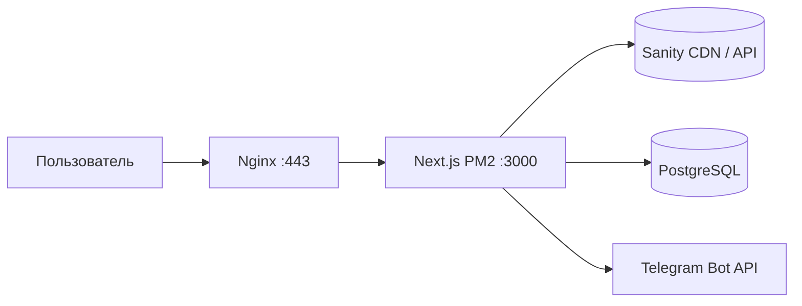

# TechZone Motors — администрирование проекта

Документ для владельца и администраторов: что это за система, как устроена, какие внешние сервисы задействованы и **какие секреты нужно иметь под рукой** (без хранения значений в репозитории).

## Назначение

Публичный сайт **TechZone Motors** (питбайки, каталог, заявки с формы). Стек: **Next.js 16** (App Router), **React 19**, контент каталога из **Sanity**, лиды в **PostgreSQL** через **Prisma**, уведомления о заявках в **Telegram**. Продакшен: **VPS** с **Nginx**, **PM2**, **Let’s Encrypt**; выкладка через **GitHub Actions** по пушу в `main`.

## Архитектура (логическая)

- **Фронт и API** — одно приложение Next.js.
- **Каталог** — чтение документов `product` из Sanity; при отсутствии проекта/сети используется локальный fallback (`lib/products-fallback.ts`).
- **Заявка (контакты)** — `POST /api/contact`: отправка сообщения в Telegram, затем запись лида в БД (`Lead`).
- **CMS** — встроенная Sanity Studio по пути `/studio` (`next-sanity`).

## Репозиторий и деплой

| Элемент | Описание |
|--------|----------|
| Код | Git (удалённый репозиторий подключается у вас; в `deploy/setup-server.sh` указан пример `github.com/anvrnv/techzonemotors.git` — при расхождении ориентируйтесь на ваш фактический remote). |
| Ветка продакшена | `main` (см. `.github/workflows/deploy.yml`). |
| CI/CD | GitHub Actions: SSH на сервер, `git fetch` + `git reset --hard origin/main` (без локальных расхождений с `main`), `npm install`, `npx prisma db push`, `npm run build`, `pm2 reload techzonemotors --update-env`. |
| Каталог на сервере | `/var/www/techzonemotors` (см. workflow и `ecosystem.config.js`). |
| Процесс PM2 | Имя приложения: `techzonemotors`. |

**Важно:** секреты деплоя хранятся в **GitHub → Settings → Secrets** (не в git).

## Сервисы и что хранить

Ниже — **имена** секретов и переменных, **не значения**. Значения: менеджер паролей, GitHub Secrets, файл `.env.local` на сервере (права `600`).

### GitHub (репозиторий)

| Секрет | Назначение |
|--------|------------|
| `SSH_HOST` | IP или hostname VPS |
| `SSH_USER` | Пользователь SSH |
| `SSH_PRIVATE_KEY` | Приватный ключ для входа на сервер |

### Сервер (VPS)

| Ресурс | Зачем |
|--------|--------|
| SSH-доступ | Администрирование, ручной деплой, логи |
| Учётная запись root/sudo | Как в вашей практике (скрипт `deploy/setup-server.sh` рассчитан на типичную настройку) |
| **Let’s Encrypt** | Сертификаты путей из `deploy/nginx.conf` (`/etc/letsencrypt/live/techzonemotors.ru/…`) |
| **Nginx** | Обратный прокси на `localhost:3000` |

### Приложение (`.env.local` локально и на сервере)

| Переменная | Назначение |
|------------|------------|
| `DATABASE_URL` | Строка подключения PostgreSQL для Prisma |
| `TELEGRAM_BOT_TOKEN` | Токен бота Telegram для `POST /api/contact` |
| `TELEGRAM_CHAT_ID` | Чат (или канал), куда уходят заявки |
| `NEXT_PUBLIC_SANITY_PROJECT_ID` | Проект Sanity (публично в клиенте) |
| `NEXT_PUBLIC_SANITY_DATASET` | Датасет (часто `production`) |
| `NEXT_PUBLIC_SANITY_API_VERSION` | Версия API Sanity (опционально, есть дефолт в коде) |
| `SANITY_API_WRITE_TOKEN` | Токен с правами записи — **только** для CLI/скриптов (seed), не обязателен для работы чтения каталога на сайте |

**Studio на домене (`/studio`):** `NEXT_PUBLIC_SANITY_PROJECT_ID` и `NEXT_PUBLIC_SANITY_DATASET` должны быть в **`.env.local` на VPS до команды `npm run build`**. Next встраивает `NEXT_PUBLIC_*` в клиент при сборке; если собрать без них, Studio падала бы с общей ошибкой Sanity. После добавления или смены этих переменных снова **`npm run build`** и **`pm2 reload techzonemotors --update-env`**.

Файлы `.env*` **в git не коммитятся** (см. `.gitignore`).

### Sanity (sanity.io)

- Аккаунт/проект Sanity, **Project ID** и **Dataset**.
- **CORS** и **токены**: по документации Sanity для вашего плана; write token — для `scripts/seed-sanity-catalog.ts` и аналогичных операций.

### PostgreSQL

- Хост, порт, БД, пользователь, пароль — обычно всё в `DATABASE_URL`.
- После изменений схемы на проде workflow выполняет `prisma db push` (учитывайте риски для продакшена; при необходимости замените на миграции по вашей политике).

### Домен и DNS

- `techzonemotors.ru` / `www` — как настроено у регистратора; для SSL используется Certbot в `setup-server.sh`.

## Полезные команды

| Действие | Команда / место |
|----------|------------------|
| Локальная разработка | `npm run dev` |
| Сборка | `npm run build` (включает `prisma generate`) |
| Заливка тестового каталога в Sanity | `npm run sanity:seed-catalog` (нужен `.env.local` и write token) |
| Логи PM2 на сервере | `pm2 logs techzonemotors` |
| Перезапуск после смены `.env.local` | `pm2 restart techzonemotors` или `pm2 reload …` как в CI |

## Документация для ИИ-агентов

Для автоматизированной работы с кодом в репозитории есть отдельный файл **`docs/AGENT_PROJECT_CHRONICLE.md`** (на английском): структура файлов, конвенции, что читать перед задачей. Он должен обновляться при изменениях кода (см. правило `.cursor/rules/chronicler-doc-update.mdc` и субагента **chronicler**).

## Контакты и эскалация

Зафиксируйте вне этого файла (внутренний runbook): кто владеет DNS, GitHub-организацией, VPS, Sanity и Telegram-ботом — чтобы при смене людей не потерять доступы.
